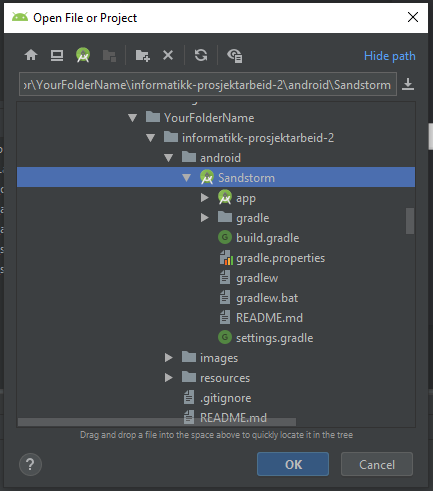
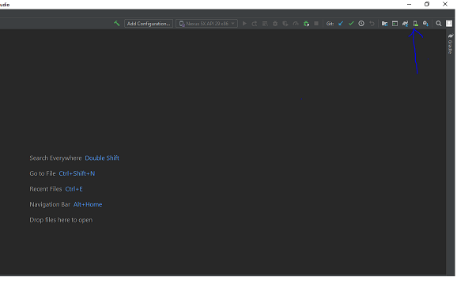
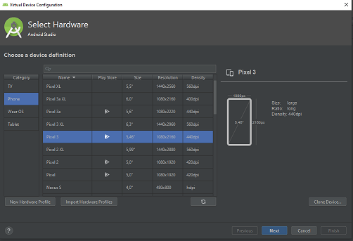
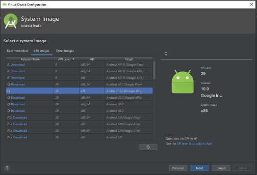
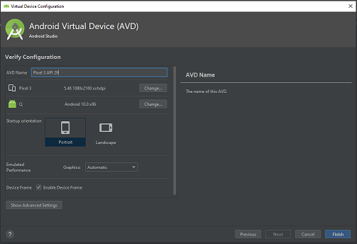
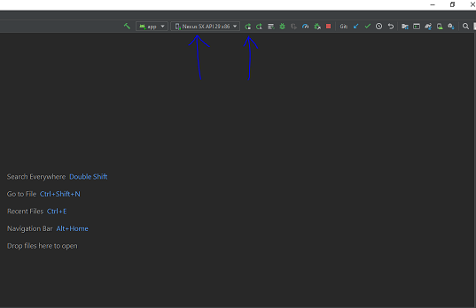

# Informatikk Prosjektarbeid 2

## Introduction

Sandstorm is a project created by 7 students for the bachelor course in informatics at NTNU.
Sandstorm is a mobile application for Android which lets the user create memes and to edit photos. The customer of the project is Zedge Norway. 
Starting the project the group were given a lot of freedom in regards to which functionality to be implemented, however it was a
requirement that the app were to be written in Kotlin for Android support. The user can draw on images, add stickers, add text, use layouts for memes, edit popular memes and more.
Once a meme is created the user is able to share it with their friends through popular social media applications or simply save it to their phones locally.

## Android Studio setup

To edit the code or use the emulator for Sandstorm you need Android Studios, you can download this [here](https://developer.android.com/studio). 
When you have Android studios you need to clone the git-repository, you find this option in the overview of the [repository](https://gitlab.stud.idi.ntnu.no/it2901/informatikk-prosjektarbeid-2/-/tree/master).
You can use different IDE's like Intellij too, but this guide describes the Android Studio approach.

1. Create a new folder on your computer. Open the terminal on your coumputer, find the path to the folder and type the command "git clone link-to-repo"+
2. Open Android Studio. Cilck File->Open. Go to your new folder and find the "Sandstorm" application within the "android"-folder

3. When you have pressed ok with the correct choice the project will open up in Android Studio and build Gradle.

The project is built with fragments and corresponding designs for these fragments. The fragments are located in **app>java>fun.sandstorm>ui>fragment** 
while the design-parts are located in **app>res>layout**

## Run the app with emulator

Android Studio lets you use the app with a built-in emulator, or if you own an Android phone you can run it directly from your phone. 
In order to use the emulator you need to install one within Android Studios.

1. To install an emulator to run the app you must open the AVD manager located in the top-right corner. Once You have opened the AVD manager you can click the button "Create Virtual Device"

2. Here you get a selection of downloadable devices. Choose whichever you prefer. It is recomended to use one that exists in Play Store, as the image shows. Click next. 
3. After this you are asked to select an image. Click x86 images and choose the recomenden one, then click next.

4. Click Finish. Now an installation process is starting. After this is completed, the virtual device will show up in the AVD manager. 

5. Now You can use the Emulator. Select the virtual device you have downloaded from the dropdown menu and clock the "Run app"- button located next to the dropdown menu as the image shows.

## Setup project on android device:

There's a guide on how to do this here https://developer.android.com/training/basics/firstapp/running-app. Below we outline the main steps.

1. Enable developer mode on your device. For Android Phones, go to Settings -> About -> Software information and tap the "Build-number" 7 times -> Enable debugger mode

2. Connect your device to your computer with a USB cable.

3. Your device should appear in the same list as your emulators. Select it and click "Run".

## Built with:

- [Android Studio](https://developer.android.com/studio) - The integrated development environment used
- [Kotlin](https://kotlinlang.org/) - The main programming language used

## Authors: 

[Contributors](https://gitlab.stud.idi.ntnu.no/it2901/informatikk-prosjektarbeid-2/-/project_members)

## Acknowledgments:

- Special thanks to the customer of the project, Alfredo Perez Fernandez! 
- Hats off for Buhran Rashid, providing the initial photo editor. 

